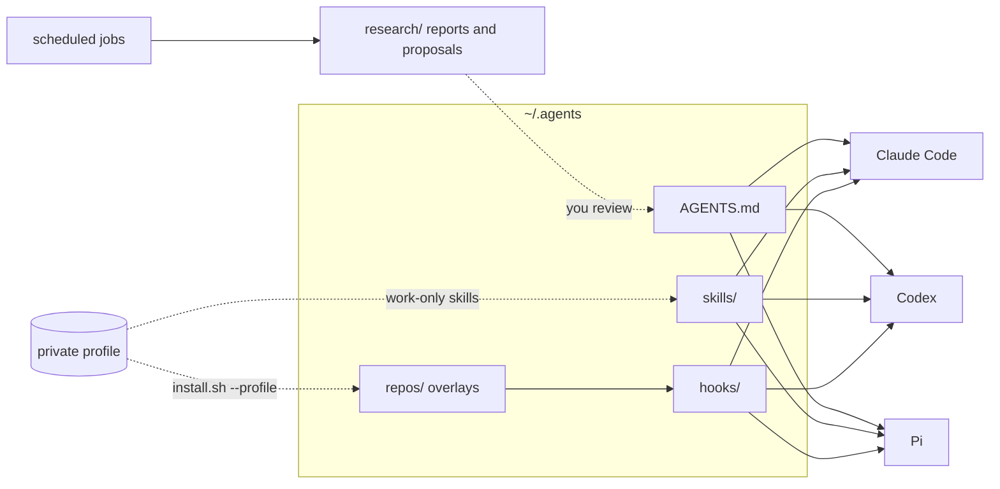
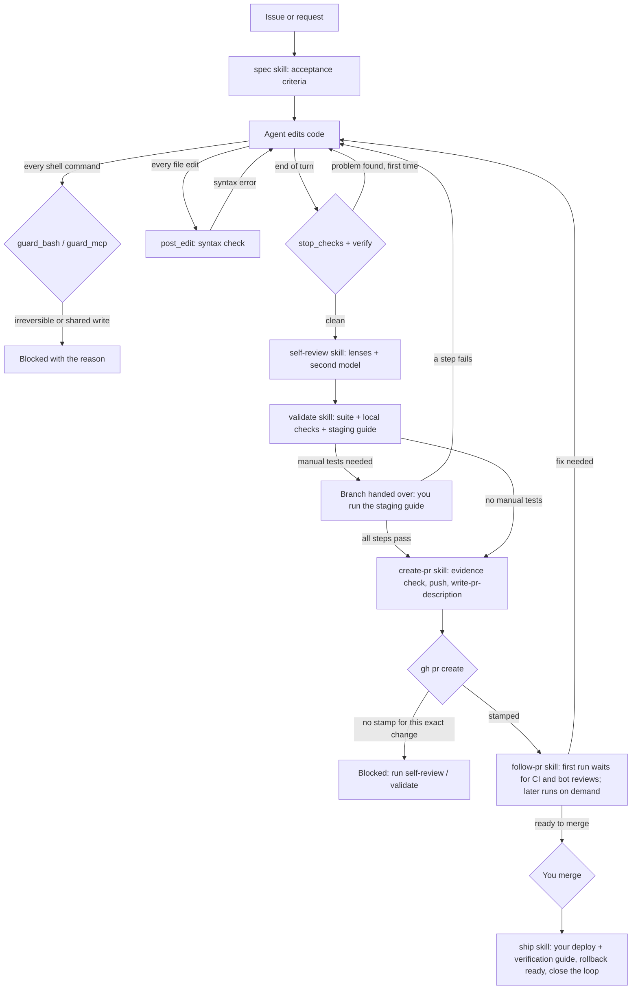
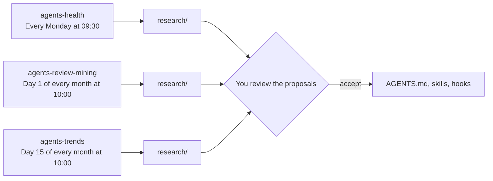

# What the agents kit does

_Generated by `bin/docs` from the kit's source; do not edit by hand. The pre-commit hook and `tests/run.sh` keep it current._

The kit gives every coding agent you use the same way of working: one set of instructions, the same skills, and the same safety and quality checks, whichever harness runs the session. It is built for Claude Code, Codex and Pi on macOS, and it works on any repository: repository-specific knowledge lives in overlays and private profiles, never in the repositories themselves.

## At a glance

- **3 harnesses** share one `AGENTS.md`, 8 skills and 4 hook scripts.
- **21 guard rules** block irreversible or outward-facing shell commands before they run.
- **Stop checks** run after every turn that edited files: leftovers, weakened tests, secrets, then the repo's verify.
- **6 stacks** are verified automatically when a repo has no hand-written verify.
- **3 scheduled jobs** watch the kit's health, look for improvements and learn from code review.
- **9 command-line tools**: a11y-check, browse, docs, gh, quality-log, repo-name, reports, triage, wp-query-profile.

## How it fits together



`install.sh` links the instructions and skills into each harness's own location and registers the hooks in its settings, so editing a file in `~/.agents` changes every harness at once. Pi has no hook config; the adapter in `adapters/pi/` translates its extension events into the same hook calls.

It also adds the kit's baseline settings where a key is missing, never overwriting one you set:

| Harness | File | Baseline |
|---|---|---|
| Claude Code | `~/.claude/settings.json` | `effortLevel="medium"`, `maxEffortLevel="xhigh"`, `fastMode=false`, `fastModePerSessionOptIn=true`, `env.CLAUDE_AUTOCOMPACT_PCT_OVERRIDE="40"` |
| Codex | `~/.codex/config.toml` | `model_reasoning_effort="high"`, `service_tier="default"`, `features.hooks=true`, `features.fast_mode=false`, `agents.max_concurrent_threads_per_session=3` |
| Pi | `~/.pi/agent/settings.json` | `defaultThinkingLevel="high"` |

## The life of a task



The stop hook asks the agent to continue at most once per turn, so a check it cannot satisfy honestly ends up in its report under **Blocked on me** instead of looping. Self-review, validate and a green verify each leave a stamp of the exact change in `.git/`; editing anything afterwards invalidates it.

When the change needs manual tests on staging, `validate` ends by handing you the branch: if the agent worked in a git worktree, it removes it (only once everything is committed and pushed) so you can switch to the branch in your main checkout. The spec, the reports, the staging guide and the review stamps live in the repository's shared `.git/agents/`, so they survive the hand-off: run `bin/reports` there. The PR is opened after you report the staging results, so its description carries them.

## Hooks

| Harness | Event | Applies to | Script | Timeout (s) |
|---|---|---|---|---|
| Claude Code | PostToolUse | Edit\|Write\|MultiEdit\|NotebookEdit | post_edit.py | 30 |
| Claude Code | PreToolUse | Bash | guard_bash.py | 10 |
| Claude Code | PreToolUse | mcp__.* | guard_mcp.py | 10 |
| Claude Code | Stop | (every stop) | stop_checks.py | 660 |
| Codex | PostToolUse | apply_patch\|Edit\|Write | post_edit.py | 30 |
| Codex | PreToolUse | Bash\|shell\|exec_command\|local_shell | guard_bash.py | 10 |
| Codex | PreToolUse | mcp__.* | guard_mcp.py | 10 |
| Codex | Stop | (every stop) | stop_checks.py | 660 |
| Pi | agent_before_settle | (every settle) | stop_checks.py | 660 |
| Pi | tool_call | bash | guard_bash.py | 660 |
| Pi | tool_result | edit\|write | post_edit.py | 660 |

**`guard_bash.py`**: PreToolUse guard for shell commands, shared by Claude Code, Codex and Pi (via adapters/pi). Blocks irreversible or outward-facing commands. It is a seatbelt against agent mistakes, not a security boundary: a determined command can evade regexes.

**`guard_mcp.py`**: PreToolUse guard for MCP tools that write to shared systems. Reads pass. Writes are denied unless the user approved that service in the last APPROVAL_MINUTES by creating ~/.agents/approvals/<service> themselves, a file the shell guard (guard_bash.py) never lets agents create.

**`post_edit.py`**: PostToolUse hook for file edits, shared by Claude Code, Codex and Pi (via adapters/pi). Runs a fast syntax check on each edited file and records that the session edited files, so the Stop hook only runs its checks after real changes.

**`stop_checks.py`**: Stop hook shared by Claude Code, Codex and Pi (via adapters/pi). Only runs when the session edited files since the last stop. Looks at the lines the branch adds since the merge-base with the default branch (committed or not) and asks the agent to continue, once, for a skipped or focused test, a deleted test file, a debug leftover, a conflict marker, a possible secret, a new option read near a cache, or a temporary compose override left behind. Then runs the repo's verify: the overlay in ~/.agents/repos/<repo-name>/verify when it exists, else repos/_shared/verify_auto.py.

Every decision is appended to `~/.agents/logs/hooks.jsonl`, which the weekly health check reads.

### What the shell guard blocks

- `git push --force`: rewrites remote history.
- `git push` to main/master/trunk/develop/production/release: bypasses review.
- `git reset --hard`: discards uncommitted work.
- `git clean -f`: deletes untracked files.
- `git checkout .` / `git restore .`: discards all uncommitted changes.
- `git branch -D`: force-deletes a branch.
- `git stash drop|clear`: deletes stashed work.
- `gh pr merge`: merging is a human decision.
- `gh repo delete|archive`: deletes or archives a repository.
- `gh release create|delete`: publishes or deletes a release.
- `gh api -X DELETE`: deletes through the GitHub API.
- `npm|pnpm|yarn publish`, `twine upload`, `gem push`, `docker push`: publishes a package or image.
- `DROP DATABASE|TABLE|SCHEMA`, `TRUNCATE TABLE`: destroys database data.
- `wp db drop|reset|clean`, `wp site empty|delete`: destroys WordPress data.
- `curl … | sh`: pipes a download straight into a shell.
- `sudo`: runs with root privileges.
- `make|npm run|composer … deploy|release|sync_db|ssh_prod`: deploys, releases or touches production.
- `chmod 777`: world-writable permissions.
- Touching `~/.agents/approvals`: approvals for shared-system writes must come from the user, not the agent.
- Recursive deletes outside the working directory or temp dirs, or of unresolved (`$VAR`, wildcard) paths.
- `gh pr create` until the self-review (and, for behavior changes, validate) stamp matches the change.

It is a seatbelt against agent mistakes, not a security boundary. MCP writes to shared systems (issue trackers, chat) need a short-lived approval that only you can create; profiles declare which operations count as writes in `mcp-writes.json`.

## Verify: checking the change at the end of every turn

"The change" is everything the branch adds since it left the default branch, committed or not, plus untracked files: what the pull request will contain. Only findings on changed lines count, so old problems in a touched file never block.

Each run saves its output as evidence (`bin/reports`), and every line says what happened: `ran:` for checks that executed, `skipped:` with the reason for checks that could not (never counted as a pass), `warning:` and `error:`.

### Automatic, for any repository

Used when a repository has no hand-written verify. Only tests related to the changed files run, never full suites.

| Files | What runs |
|---|---|
| `.js`, `.jsx`, `.ts`, `.tsx`, `.mjs`, `.cjs` | ESLint on changed lines; Vitest or Jest on the tests related to the changed files. |
| `.php` |  |
| `.py` | Ruff on changed lines; pytest on the related test_<module>.py or <module>_test.py files. |
| `.go` |  |
| `.rs` | cargo check on the crate. |
| `.sh`, `.bash` | ShellCheck on changed lines. |

Project-local tools win over global ones (`node_modules/.bin`, `vendor/bin`, `.venv/bin`).

### Hand-written, per repository

A repository that needs more (a Docker stack, known failing tests, project rules) gets an executable `repos/<repo>/verify` (`<repo>` as `bin/repo-name` prints it, the same from any worktree), usually built on `repos/_shared/verify_changed.py`:

| Option | What it does |
|---|---|
| `--semgrep` | semgrep rules file; repeat for several |
| `--phpcs` | PHPCS command emitting JSON; changed PHP files are appended |
| `--phpstan` | PHPStan command emitting JSON; changed PHP files are appended |
| `--cwd` | subdirectory the PHPCS/PHPStan/PHPUnit commands run from |
| `--start-hint` | copy-paste command that starts the --requires-container stack |
| `--phpunit` | unit-suite command that runs locally without Docker or network |
| `--baseline` | file listing test ids already failing on a clean checkout |
| `--refresh-baseline` | record current failures (clean tree only) |
| `--phpunit-cwd` | where to run the PHPUnit command (default: --cwd) |
| `--junit-host` | repo-relative path where a containerized run writes its JUnit log |
| `--related-tests` | test dir (relative to --cwd): run only tests related to the diff via {filter} |
| `--requires-container` | container that must be running for PHPUnit |
| `--php-min` | lint changed PHP files on this minimum version (e.g. 7.4) in a php:<v>-cli container |
| `--red-check` | changed tests must fail without the change, on the merge-base (local PHPUnit only) |

#### Semgrep rules shipped with the kit

| Rule | Severity | Catches |
|---|---|---|
| `update-option-false-noop` | ERROR | update_option() with a boolean false is a silent no-op when the option doesn't exist yet: get_option() already returns false, so WordPress sees "no change" and writes nothing. |
| `options-api-stubbed-in-test` | WARNING | This test fakes update_option(). |
| `wp-rest-route-without-permission-callback` | ERROR | REST route registered without a permission_callback. |
| `wp-unbounded-query` | ERROR | Unbounded query: fetches every matching row. |
| `wp-query-in-loop` | ERROR | Database query inside a loop (N+1). |

## Skills

| Skill | Source | What it's for |
|---|---|---|
| `clarity` | https://github.com/addyosmani/clarity.git | Draft, rewrite or review prose other people will read, so it is specific and sounds like its author without inventing facts. |
| `create-pr` | core | Open the pull request once the change is reviewed and validated. Checks that verify, self-review, validate and any staging tests passed for the exact current change, pushes the branch, writes the title and description with the write-pr-description skill, and runs gh pr create. Use when a change is ready for a PR, instead of calling gh pr create directly. |
| `follow-pr` | core | Take an open pull request to ready-to-merge. Handles what is new since the last run: CI failures the change caused and review comments from people and bots, each verified before it is fixed or answered, with review and testing of every fix. Runs once right after create-pr (waiting for CI and bot reviews), then whenever the user asks to follow up on the PR. |
| `self-review` | core | Adversarial multi-lens review of your own diff before it goes to a human, using focused reviewers and a second model family, then verifying every finding before acting on it. Use before opening or updating a pull request, before declaring a non-trivial change done, or when asked to review the current branch. |
| `ship` | core | See a merged pull request safely into production. Gives the user a step-by-step deploy and light production verification guide to run themselves, prepares the rollback, and closes the loop (issue update, repo notes, local branch). Use when the user is about to deploy a merged PR or says it is deployed. |
| `spec` | core | Turn an issue or request into a short spec with checkable acceptance criteria before building, so the work and the self-review are judged against what was actually asked. Use when starting work on a Linear or GitHub issue, or on any request bigger than a small, unambiguous change. |
| `validate` | core | Validate a change end to end before it goes to review. Runs the full unit suite (in Docker if the repo needs it), exercises every acceptance criterion against the local environment with temporary scripts covering positive and negative cases, writes a step-by-step guide for whatever can only be tested on staging or production, and hands the branch over for those tests. Use for behavior changes before opening a PR, or when asked to test a change. |
| `write-pr-description` | core | Write short, blunt, human-sounding pull request titles and descriptions that lead with functional impact and keep technical detail at architectural altitude, based on the actual code changes, repository context, issue requirements, validation evidence, and the repository's configured PR template. Use when opening, updating, or preparing a pull request. |

Harnesses pick a skill by its description; you can also call one by name (`/spec` in Claude Code).

## Command-line tools

**`bin/a11y-check`**: Accessibility check (axe-core) of the given URLs. See ~/.agents/tools/a11y/check.mjs.

**`bin/browse`**: A/B harness for browser tooling in the validate skill: Playwright CLI vs agent-browser.

```
browse assign                         pick the tool for this validation run (balanced alternation)
browse <tool args...>                 run the assigned tool with these args, logging the call
browse finish --checks N --passed P [--tool-issues K] [--notes "..."]
```

**`bin/docs`**: Generate docs/framework.md, the reference for what the kit does, from the kit's own source.

```
docs            regenerate docs/framework.md
docs --check    exit 1 when docs/framework.md is out of date (tests/run.sh, the pre-commit hook)
```

**`bin/gh`**: Runs the real gh with git's per-host proxy. gh ignores git's `http.<url>.proxy`, so a host reachable only through a proxy (a SOCKS tunnel, for example) makes it hang. This finds the host a call targets, passes git's proxy for it as HTTPS_PROXY, and fails at once when that proxy isn't answering. Linked ahead of the real gh in PATH (install.sh --doctor shows how).

**`bin/quality-log`**: Record what a review lens or test type produced, so the monthly job can keep only perspectives that pay off.

```
quality-log lens <name> --findings N --confirmed M [--secs S] [--model claude|codex]
quality-log test <type> --issues N [--secs S] [--notes "..."]
```

**`bin/repo-name`**: Print the repository's name as the kit knows it: the main checkout's directory name, the same from any worktree (Xirp, Conductor and `git worktree add` all name theirs differently). ~/.agents/repos/<name> is its overlay.

**`bin/reports`**: Review and testing reports for the current repo and branch, stored next to the spec (outside the tree).

```
reports path <verify|review|validation|staging-guide|follow-pr>   where the stop hook or a skill saves that report
reports                                          print every report that exists, with its path
```

**`bin/triage`**: Deterministic triage of the current change: risk tier, review lenses and test types, with reasons.

```
triage                  change vs the merge-base with the default branch (committed + uncommitted + untracked)
triage --range A..B     a commit range instead (for calibration on past changes)
triage --json           machine-readable output
```

**`bin/wp-query-profile`**: Count the SQL queries a REST route or PHP snippet runs inside the local WordPress, and flag N+1 patterns.

```
wp-query-profile --rest GET /wp/v2/posts [--params '{"per_page": 20}'] [--user 1]
wp-query-profile --php 'my_function_under_test( 20 );' [--user 1]
```

## Periodic operations

`install.sh` renders the templates in `launchd/` into `~/Library/LaunchAgents/` and loads them. No job changes the kit: they write reports and proposals under `research/` for you to review.

| Job | When | Runs | What it does |
|---|---|---|---|
| `agents-health` | Every Monday at 09:30 | `monitors/health.sh` | Weekly framework health check. Deterministic, no model calls. Writes research/health/<date>.md and notifies only when something needs attention. |
| `agents-review-mining` | Day 1 of every month at 10:00 | `review-mining/run.sh` | Monthly review mining: fetch new human review comments, have Claude classify them and propose AGENTS.md changes as a diff. Never edits AGENTS.md itself. |
| `agents-trends` | Day 15 of every month at 10:00 | `monitors/trends.sh` | Mid-month trends scan: what changed in the harnesses, models and tools, and what the kit could adopt or retire. Proposes only; the model gets read and web tools, no write or shell access, and the script saves its answer. |



## Profiles: private, per-employer knowledge

The kit itself holds nothing tied to one company. A profile is a separate (usually private) repository that `install.sh --profile <dir>` layers in through symlinks, so hooks, skills and instructions use the same paths with or without it:

| In the profile | Linked or read as |
|---|---|
| `repos/<repo>/` | `~/.agents/repos/<repo>` (notes, verify overlays, baselines) |
| `skills/<name>/` | `~/.agents/skills/<name>` |
| `research/*` | `~/.agents/research/*` |
| `mcp-writes.json` | read by `hooks/guard_mcp.py` |
| `review-mining/repos.txt` | repositories the monthly review mining reads |
| `PROFILE.md` | work context for the trends scan |

## What the agents are told

`AGENTS.md` sections, in order:

- How to work: like a staff engineer
  - Understand before changing
  - Keep the change right-sized
  - Write code a senior reviewer would approve
  - Build for production at scale
  - Choosing an approach
  - Verify with evidence
  - Defects reviewers catch most
  - Leave the system better
- Autonomy
- Pull requests
- Code comments
- Skills and instructions
- Communication

## Install and maintain

```
./install.sh                  install or repair
./install.sh --doctor         report only, change nothing
./install.sh --profile <dir>  add a profile (a private repo with repo overlays, skills, research, rules)
```

- `tests/run.sh` runs the regression suite: hooks, generic verify, semgrep fixtures, the Pi adapter, triage, a real install into an empty HOME, the install doctor, and this reference (up to date, and every diagram parses as GitHub renders it).
- After changing the kit, commit as usual: the pre-commit hook regenerates this file.

## Layout

| Path | Purpose |
|---|---|
| `.githooks/` | Keeps this reference in sync on every commit. |
| `AGENTS.md` | The instructions every harness loads (linked as CLAUDE.md / AGENTS.md). |
| `LICENSE` | MIT. |
| `README.md` | Install and first steps. |
| `adapters/` | Per-harness glue: the Pi extension, the Claude Code status line, Codex profiles. |
| `bin/` | Command-line tools the skills and people call. |
| `docs/` | This reference and the research behind the instructions. |
| `hooks/` | The hook scripts all harnesses share (one JSON contract: stdin in, decision out). |
| `install.sh` | Wires the kit into each installed harness; `--doctor` reports without changing anything. |
| `launchd/` | Templates for the scheduled jobs (macOS). |
| `monitors/` | The weekly health check and the mid-month trends scan. |
| `repos/` | Per-repository overlays (`notes.md`, `verify`) and the shared verify scripts in `_shared/`. |
| `review-mining/` | The monthly job that learns from human code-review comments. |
| `skills.external` | Third-party skills install.sh clones from their source. |
| `skills/` | Skills linked into every harness; third-party ones are listed in `skills.external`. |
| `tests/` | The regression suite: `tests/run.sh`. |
| `tools/` | Node code and dependencies for the tools in `bin/` and the diagram check in `tests/run.sh`. |
| `usage/` | Session and pull-request extractors that feed the monthly analysis. |
