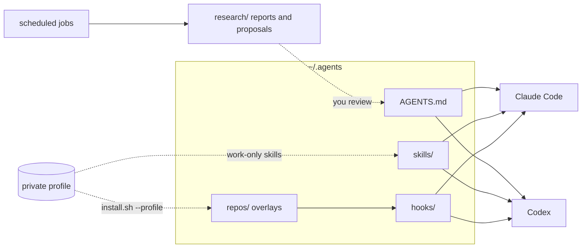
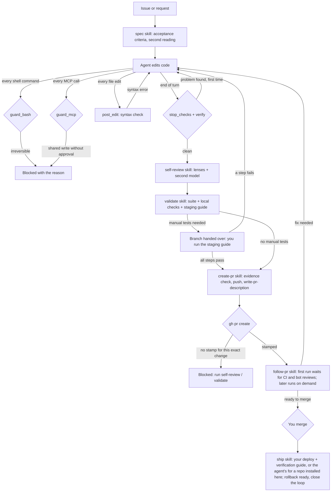
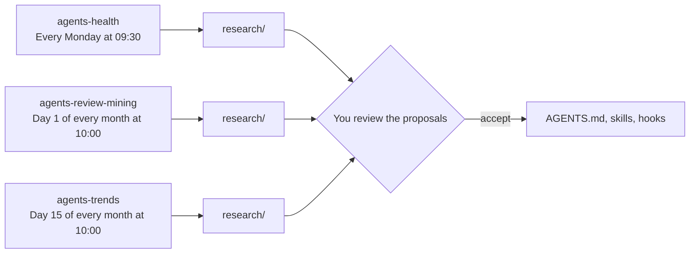

# What the agents kit does

_Generated by `bin/docs` from the kit's source; do not edit by hand. The pre-commit hook and `tests/run.sh` keep it current._

The kit gives every coding agent you use the same way of working: one set of instructions, the same skills, and the same safety and quality checks, whichever harness runs the session. It is built for Claude Code and Codex on macOS, and it works on any repository: repository-specific knowledge lives in overlays and private profiles, never in the repositories themselves.

## At a glance

- **2 harnesses** share one `AGENTS.md`, 9 skills and 6 hook scripts.
- **22 guard rules** block irreversible or outward-facing shell commands before they run.
- **Stop checks** run after every turn that edited files: leftovers, weakened tests, secrets (when gitleaks is installed), files outside the spec's Change map, then the repo's verify. After a turn that pushed, they also ask about the pushed commit's CI when it failed, is still running or can't be read (`bin/ci-wait`).
- **6 stacks** are verified automatically when a repo has no hand-written verify.
- **3 scheduled jobs** watch the kit's health, look for improvements and learn from code review.
- **19 command-line tools**: a11y-check, approve, browse, changelog, ci-wait, docs, evidence, free-branch, gh, phase, pr-comments, pr-validation, prune-merged, quality-log, repo-name, reports, staging, triage, wp-query-profile.

## How it fits together


```mermaid
flowchart LR
  subgraph kit["~/.agents"]
    A[AGENTS.md]
    S[skills/]
    H[hooks/]
    R[repos/ overlays]
  end
  P[(private profile)] -.->|"install.sh --profile"| R
  P -.->|"work-only skills"| S
  A --> X0[Claude Code]
  S --> X0
  H --> X0
  A --> X1[Codex]
  S --> X1
  H --> X1
  R --> H
  M[scheduled jobs] --> F[research/ reports and proposals]
  F -.->|"you review"| A
```

`install.sh` links the instructions and skills into each harness's own location and registers the hooks in its settings, so editing a file in `~/.agents` changes every harness at once.

It also adds the kit's baseline settings where a key is missing, never overwriting one you set:

| Harness | File | Baseline |
|---|---|---|
| Claude Code | `~/.claude/settings.json` | `effortLevel="medium"`, `maxEffortLevel="xhigh"`, `fastMode=false`, `fastModePerSessionOptIn=true`, `cleanupPeriodDays=90`, `env.CLAUDE_AUTOCOMPACT_PCT_OVERRIDE="40"` |
| Codex | `~/.codex/config.toml` | `model_reasoning_effort="high"`, `service_tier="default"`, `features.hooks=true`, `features.fast_mode=false`, `agents.max_concurrent_threads_per_session=3` |

## The life of a task


```mermaid
flowchart TD
  T[Issue or request] --> SP[spec skill: acceptance criteria, second reading]
  SP --> W[Agent edits code]
  W -->|every shell command| G{guard_bash}
  G -->|irreversible| B[Blocked with the reason]
  W -->|every MCP call| GM{guard_mcp}
  GM -->|shared write without approval| B
  W -->|every file edit| PE[post_edit: syntax check]
  PE -->|syntax error| W
  W -->|end of turn| SC{stop_checks + verify}
  SC -->|problem found, first time| W
  SC -->|clean| SR[self-review skill: lenses + second model]
  SR --> V[validate skill: suite + local checks + staging guide]
  V -->|manual tests needed| HO[Branch handed over: you run the staging guide]
  HO -->|a step fails| W
  HO -->|all steps pass| CP
  V -->|no manual tests| CP[create-pr skill: evidence check, push, write-pr-description]
  CP --> PR{gh pr create}
  PR -->|no stamp for this exact change| G2[Blocked: run self-review / validate]
  PR -->|stamped| FP[follow-pr skill: first run waits for CI and bot reviews; later runs on demand]
  FP -->|fix needed| W
  FP -->|ready to merge| MG{You merge}
  MG --> SH[ship skill: your deploy + verification guide, or the agent's for a repo installed here; rollback ready, close the loop]
```

The stop hook asks the agent to continue at most once per turn, so a check it cannot satisfy honestly ends up in its report under **Blocked on me** instead of looping. Self-review, validate and a green verify each leave a stamp of the exact change in `.git/`; editing anything afterwards but the changelog (CHANGELOG.md or `changelog.d/`) invalidates it. Merging the default branch keeps the self-review, validate and staging stamps when the branch's own diff is unchanged, and invalidates verify's: the tests run again on the merged code. Only running verify (the stop hook, or `stop_checks.py verify`) writes its stamp. A green verify that ran no check (no `ran:` line) leaves a separate stamp, and the status line says "verify checked nothing".

When the change needs manual tests on staging, `validate` ends by handing you the branch: if the agent worked in a git worktree, it detaches it from the branch (only once everything is committed and pushed) so you can switch to the branch in your main checkout, and keeps the directory its session runs in. The spec, the reports, the staging guide and the review stamps live in the repository's shared `.git/agents/`, so they survive the hand-off: run `bin/reports` there. The PR is opened after you report the staging results, so its description carries them.

## Hooks

| Harness | Event | Applies to | Script | Timeout (s) |
|---|---|---|---|---|
| Claude Code | PostToolUse | Edit\|Write\|MultiEdit\|NotebookEdit | post_edit.py | 30 |
| Claude Code | PreToolUse | Bash | guard_bash.py | 10 |
| Claude Code | PreToolUse | Edit\|Write\|MultiEdit\|NotebookEdit | guard_files.py | 10 |
| Claude Code | PreToolUse | mcp__.* | guard_mcp.py | 10 |
| Claude Code | Stop | (every stop) | stop_checks.py | 660 |
| Claude Code | UserPromptSubmit | (every stop) | prompt_approvals.py | 10 |
| Codex | PostToolUse | apply_patch\|Edit\|Write | post_edit.py | 30 |
| Codex | PreToolUse | Bash\|shell\|exec_command\|local_shell | guard_bash.py | 10 |
| Codex | PreToolUse | apply_patch\|Edit\|Write | guard_files.py | 10 |
| Codex | PreToolUse | mcp__.* | guard_mcp.py | 10 |
| Codex | Stop | (every stop) | stop_checks.py | 660 |
| Codex | UserPromptSubmit | (every stop) | prompt_approvals.py | 10 |

**`guard_bash.py`**: PreToolUse guard for shell commands, shared by Claude Code and Codex. Blocks irreversible or outward-facing commands. It is a seatbelt against agent mistakes, not a security boundary: a determined command can evade regexes. Records the checkout of each allowed `git push`, so the stop hook can follow that commit's CI.

**`guard_files.py`**: PreToolUse guard for file tools (Claude Code Edit/Write/MultiEdit/NotebookEdit, Codex apply_patch/Edit/Write): Impeccable's project files in a shared repository need the user first (design_files.py).

**`guard_mcp.py`**: PreToolUse guard for MCP tools that write to shared systems. Reads pass. Writes are allowed when the user's current message names the service (prompt_approvals.py) or they allowed it in Claude Code's dialog (bin/approve), or the user approved it in the last APPROVAL_MINUTES by creating ~/.agents/approvals/<service> themselves. The shell guard (guard_bash.py) never lets agents create any of them.

**`post_edit.py`**: PostToolUse hook for file edits, shared by Claude Code and Codex. Runs a fast syntax check on each edited file and records that the session edited files, so the Stop hook only runs its checks after real changes.

**`prompt_approvals.py`**: UserPromptSubmit hook for Claude Code and Codex. Asking for a write is approving it: when the user's message names a service guard_mcp.py guards (Linear, or one a profile declares), or one of Impeccable's project files design_files.py guards, writes to it are allowed until the user's next message. A DROP or TRUNCATE statement guard_bash.py refuses needs more than a mention: the message opens with the line `allow <statement>`, or does nothing but ask for it in plain words ("Sí, borra las bases de prueba", "drop the test databases"). A message whose first line is `phase off|on <phase> [branch|repo|global]` switches a flow phase (phase_switches.py), and the hook tells the agent what is off now. Only the user's own messages reach this hook, so an agent can't grant itself one; mentioning the service only to read from it approves writes for that turn too.

**`stop_checks.py`**: Stop hook shared by Claude Code and Codex. After a turn that edited files since the last stop, looks at the lines the branch adds since the merge-base with the default branch (committed or not) and asks the agent to continue, once, for a skipped or focused test, a deleted test file, a debug leftover, a conflict marker, a possible secret, a new option read near a cache, a temporary compose override left behind, or a changed code file the spec's Change map doesn't name. Then runs the repo's verify: the overlay in ~/.agents/repos/<repo-name>/verify when it exists, else repos/_shared/verify_auto.py. After a turn that pushed (the shell guard records it), even one that edited nothing, asks about the pushed commit's CI when it failed, is still running or can't be read. Once a branch's PR is open and the session's context is over CONTEXT_NUDGE_TOKENS, or the session moves on to another change with its context over NEW_CHANGE_NUDGE_TOKENS, tells the user, once, that a new session picks it up for less (Claude Code only: it reads the transcript). Every stop also starts each profile's `after-turn` in the background with the stop payload on stdin, and doesn't wait for it. The Change map question, verify and the CI question each stay quiet for a checkout whose user switched off the spec, verify or ci phase (phase_switches.py); the other checks always run.

Every block, every approved or browser MCP call and every shell command a user's `allow` line or approval file let through is appended to `~/.agents/logs/hooks.jsonl`, which the weekly health check reads. Other allowed shell commands are not logged.

### What the shell guard blocks

- `git push --force`: rewrites remote history.
- `git push` to main/master/trunk/develop/production/release: bypasses review.
- `git reset --hard`: discards uncommitted work.
- `git clean -f`: deletes untracked files.
- `git checkout .`: discards all uncommitted changes.
- `git restore .`: discards all uncommitted changes.
- `git branch -D`: force-deletes a branch.
- `git stash drop|clear`: deletes stashed work.
- `gh pr merge`: merging is a human decision.
- `gh repo delete|archive`: deletes or archives a repository.
- `gh release create|delete`: publishes or deletes a release.
- `gh api -X DELETE`: deletes through the GitHub API.
- `npm|pnpm|yarn publish`, `twine upload`, `gem push`, `docker push`: publishes a package or image.
- `DROP DATABASE|TABLE|SCHEMA`, `TRUNCATE TABLE`: destroys database data. Instead of running it themselves, the user can allow one until their next message, by sending a message that only asks for it in plain words (`drop the test databases`) or that starts with the line `allow DROP DATABASE` (or the statement needed).
- `wp db drop|reset|clean`, `wp site empty|delete`: destroys WordPress data.
- `curl … | sh`: pipes a download straight into a shell.
- `sudo`: runs with root privileges.
- `make|npm run|composer … deploy|release|sync_db|ssh_prod`: deploys, releases or touches production.
- `chmod 777`: world-writable permissions.
- Touching `~/.agents/approvals`: approvals for shared-system writes must come from the user, not the agent.
- Recursive deletes outside the working directory or temp dirs, or of unresolved (`$VAR`, wildcard) paths.
- `gh pr create` until the self-review (and, for behavior changes, validate) stamp matches the change.
- `gh pr ready`, and `gh pr create` without `--draft`, until every staging step before the merge has a PASS backed by saved evidence, recorded for the current change (`review_stamp.py write --kind staging`).

It is a seatbelt against agent mistakes, not a security boundary. MCP writes to shared systems need your approval: naming the service in your message approves it until your next one, and otherwise you create a short-lived approval that the agent can't. The core knows Linear's write operations; profiles declare other servers' in `mcp-writes.json`, and writes to a server no one has declared are not guarded. In a repository other people work in, Impeccable's project files (PRODUCT.md, DESIGN.md, `.impeccable/`, adding them to `.gitignore`) and its `live` and `hooks on`/`reset` wait the same way for your message naming them (`hooks/guard_files.py` for file tools, the shell guard for commands); a profile lists your own owners in `personal-repos.txt`. For MCP writes and `DROP`/`TRUNCATE` commands, Claude Code's mod asks you right away instead, in a dialog that shows the blocked call: allowing it writes the approval your message would, for that one call or until your next message (`bin/approve`, which the shell guard refuses from the agent).

## Verify: checking the change at the end of every turn

"The change" is everything the branch adds since it left the default branch, committed or not, plus untracked files: what the pull request will contain. Only findings on changed lines count, so old problems in a touched file never block.

Each run saves its output as evidence (`bin/reports`), and every line says what happened: `ran:` for checks that executed, `skipped:` with the reason for checks that could not (never counted as a pass), `warning:` and `error:`.

### Automatic, for any repository

Used when a repository has no hand-written verify. Only tests related to the changed files run, never full suites.

| Files | What runs |
|---|---|
| `.js`, `.jsx`, `.ts`, `.tsx`, `.mjs`, `.cjs` | ESLint on changed lines; Vitest or Jest on the tests related to the changed files. |
| `.php` | php -l; PHPCS and PHPStan on changed lines when the project configures them; PHPUnit on related test classes. |
| `.py` | Ruff on changed lines; pytest on the related test_<module>.py or <module>_test.py files. |
| `.go` | gofmt -l on changed files; go vet and go test on the changed packages. |
| `.rs` | cargo check on the crate. |
| `.sh`, `.bash` | ShellCheck on changed lines. |

ESLint, Ruff and pytest come from the project (`node_modules/.bin`, `.venv/bin`) when installed there, else from `PATH`. PHP tools and JavaScript test runners only run when the project installs them (`vendor/bin`, `node_modules/.bin`); otherwise they are reported as skipped.

### Hand-written, per repository

A repository that needs more (a Docker stack, known failing tests, project rules) gets an executable `repos/<repo>/verify` (`<repo>` as `bin/repo-name` prints it, the same from any worktree), usually built on `repos/_shared/verify_changed.py`:

| Option | What it does |
|---|---|
| `--semgrep` | semgrep rules file; repeat for several |
| `--phpcs` | PHPCS command emitting JSON; changed PHP files are appended |
| `--phpstan` | PHPStan command emitting JSON; changed PHP files are appended |
| `--cwd` | subdirectory the PHPCS/PHPStan/PHPUnit commands run from |
| `--start-hint` | copy-paste command that starts the --requires-container stack |
| `--phpunit` | unit-suite command that runs locally without Docker or network |
| `--baseline` | file listing test ids already failing on a clean checkout |
| `--refresh-baseline` | record current failures (clean tree only) |
| `--phpunit-cwd` | where to run the PHPUnit command (default: --cwd) |
| `--junit-host` | repo-relative path where a containerized run writes its JUnit log |
| `--related-tests` | test dir (relative to --cwd): run only tests related to the diff via {filter} |
| `--requires-container` | container that must be running for PHPUnit |
| `--php-min` | lint changed PHP files on this minimum version (e.g. 7.4) in a php:<v>-cli container |
| `--red-check` | changed tests must fail without the change, on the merge-base (local PHPUnit only) |

#### Semgrep rules shipped with the kit

| Rule | Severity | Catches |
|---|---|---|
| `update-option-false-noop` | ERROR | update_option() with a boolean false is a silent no-op when the option doesn't exist yet: get_option() already returns false, so WordPress sees "no change" and writes nothing. |
| `options-api-stubbed-in-test` | WARNING | This test fakes update_option(). |
| `wp-rest-route-without-permission-callback` | ERROR | REST route registered without a permission_callback. |
| `wp-unbounded-query` | ERROR | Unbounded query: fetches every matching row. |
| `wp-query-in-loop` | ERROR | Database query inside a loop (N+1). |

## Skills

| Skill | Source | What it's for |
|---|---|---|
| `clarity` | https://github.com/addyosmani/clarity.git | Draft, rewrite or review prose other people will read, so it is specific and sounds like its author without inventing facts. |
| `create-pr` | core | Open the pull request once the change is reviewed and validated. Checks that verify, self-review, validate and any staging tests passed for the exact current change, pushes the branch, writes the title and description with the write-pr-description skill, and runs gh pr create. Use when a change is ready for a PR, instead of calling gh pr create directly. |
| `follow-pr` | core | Take an open pull request to ready-to-merge. Handles what is new since the last run: CI failures the change caused and review comments from people and bots, each verified before it is fixed or answered, with review and testing of every fix. Runs once right after create-pr (waiting for CI and bot reviews), then whenever the user asks to follow up on the PR. |
| `impeccable` | https://github.com/pbakaus/impeccable.git, `.claude/skills/impeccable` at 508d7e8 | Design, critique, audit and polish frontend interfaces with a consistent visual direction, and keep an existing brand. |
| `self-review` | core | Adversarial multi-lens review of your own diff before it goes to a human, using focused reviewers and a second model family, then verifying every finding before acting on it. Use before opening or updating a pull request, before declaring a non-trivial change done, or when asked to review the current branch. |
| `ship` | core | See a merged pull request safely into production. Gives the user a step-by-step deploy and light production verification guide to run themselves, or, for a repo installed on this machine, deploys and runs the checks itself; prepares the rollback, and closes the loop (issue update, repo notes, local branch). Use when the user is about to deploy a merged PR, says it is deployed, or says a PR of a repo installed on this machine is merged. |
| `spec` | core | Turn an issue or request into a short spec with checkable acceptance criteria before building, so the work and the self-review are judged against what was actually asked. Use when starting work on a Linear or GitHub issue, or on any request bigger than a small, unambiguous change. |
| `validate` | core | Validate a change end to end before it goes to review. Runs the full unit suite (in Docker if the repo needs it), exercises every acceptance criterion against the local environment with temporary scripts covering positive and negative cases, writes a step-by-step guide for whatever can only be tested on staging or production or after the merge, and hands the branch over for staging tests. Use for behavior changes before opening a PR, or when asked to test a change. |
| `write-pr-description` | core | Write short, blunt, human-sounding pull request titles and descriptions that lead with functional impact and keep technical detail at architectural altitude, based on the actual code changes, repository context, issue requirements, validation evidence, and the repository's configured PR template. Use when opening, updating, or preparing a pull request. |

Harnesses pick a skill by its description; you can also call one by name (`/spec` in Claude Code).

## Claude Code mod

Claude Code also loads the kit as a plugin (`mods/kit/`), whose mod draws in Claude Code, defines the self-review's reviewer agents, runs the kit's tools without a turn and asks you about a blocked call you could approve. It owns no state and no safety: it shows and runs what the rest of the kit does, and the hooks still decide what is blocked, so Codex, and a session without the mod, get the same flow. Each capability names what Codex has instead.

| Command, hook or agent | Capability | Codex has instead |
|---|---|---|
| `/flow`: Show where this branch is in the kit's flow, and run verify without a turn | Phase and reports | `bin/reports brief` |
|  | Follows the branch into the main checkout once validate detaches the session's own | the commands of this list, run from the main checkout |
|  | Stamps (verify, self-review, validate, staging), current or not, and a verify that checked nothing | `python3 ~/.agents/hooks/review_stamp.py check --kind <kind>` |
|  | The last verify report's ran/skipped/warning/error lines | `cat "$(~/.agents/bin/reports path verify)"` |
|  | CI of the pushed HEAD | `bin/ci-wait --once --no-log` |
|  | Context use | nothing (Codex shows its own) |
|  | Run verify button, without a turn, on the checkout the pane shows | `python3 ~/.agents/hooks/stop_checks.py verify` in a terminal |
|  | Refresh button, and a refresh after each turn while the pane is open | running the commands above again |
|  | The staging guide's steps before the merge, each with its latest result, who gave it, and its evidence files | `bin/staging steps --json` |
|  | Pass button on each step before the merge, recorded as the user's verdict | `bin/staging mark <step> PASS --by user` in a terminal (the shell guard refuses it from the agent) |
|  | Fail button on each step before the merge, recorded as the user's verdict | `bin/staging mark <step> FAIL --by user` in a terminal |
| `tool.call` hook: Ask the user in a dialog when a kit guard blocks a call they could approve | A blocked MCP write or `DROP`/`TRUNCATE` command shown in a dialog: allowed once, until the user's next message, or kept blocked | the user's next message naming the service or opening with `allow <statement>`, or `touch ~/.agents/approvals/<service>` |
| `kit:review-<lens>` agents: One reviewer agent type per self-review lens | One for each lens `bin/triage --lens-briefs` prints: its brief from lenses.md, no edit tools, no CLAUDE.md block | a subagent given the lens text from `skills/self-review/lenses.md` |

The rules every mod follows are in the README (Mods contract). `install.sh` installs the plugin when Claude Code 2.1.287 or later is installed.

## Command-line tools

**`bin/a11y-check`**: Accessibility check (axe-core) of the given URLs. See ~/.agents/tools/a11y/check.mjs.

**`bin/approve`**: The approvals a guard's block needs, and the turn approvals the user's answer in a dialog writes.

```
approve needed < payload.json        {names, what, scope}: the approvals the rule that blocked this call needs
approve grant <session> <name>...    write them as turn approvals, as the user's message would, until their next one
approve once <session> <name>...     write them for one call, unless the turn has them
approve revoke <session> <name>...   remove the ones `once` wrote; a turn approval stays
```

**`bin/browse`**: A/B harness for browser tooling in the validate skill: Playwright CLI vs agent-browser.

```
browse assign                         pick the tool for this validation run (balanced alternation)
browse <tool args...>                 run the assigned tool with these args, logging the call
browse finish --checks N --passed P [--tool-issues K] [--notes "..."]
```

**`bin/changelog`**: Cut a release from the changelog entries: each pull request adds its own changelog.d/<branch>.md, without a number.

```
changelog release <version>   move CHANGELOG.md's Unreleased lines and every changelog.d/ entry under
```

**`bin/ci-wait`**: Wait for the CI checks of one commit and say how they ended.

```
ci-wait [--sha SHA] [--timeout SECS] [--once] [--no-log]
```

**`bin/docs`**: Generate docs/framework.md, the reference for what the kit does, from the kit's own source.

```
docs            regenerate docs/framework.md
docs --check    exit 1 when docs/framework.md is out of date (tests/run.sh, the pre-commit hook)
```

**`bin/evidence`**: Run a validation check and keep what it showed: evidence <id> <command> [args...] Prints the command's output and exits with its code, and saves <id>.txt in `reports path evidence` with the command, directory, time, exit code and output. The command is argv, not a string: for a pipe, pass `bash -c '...'`, which the shell guard reads as code. Exits 74 when the evidence couldn't be saved, whatever the command returned. EVIDENCE_DIR saves there instead, from any directory: a staging guide's steps run outside the repository.

**`bin/free-branch`**: Free a pushed branch from its worktree, so the user can switch to it in the main checkout.

```
free-branch <worktree>
```

**`bin/gh`**: Runs the real gh with git's per-host proxy. gh ignores git's `http.<url>.proxy`, so a host reachable only through a proxy (a SOCKS tunnel, for example) makes it hang. This finds the host a call targets, passes git's proxy for it as HTTPS_PROXY, and fails at once when that proxy isn't answering. Linked ahead of the real gh in PATH (install.sh --doctor shows how).

**`bin/phase`**: Where the current branch is in the kit's flow, for the status line: spec → build → self-review → validate → staging → create-pr → PR open → ship.

```
phase             print the cached phase at once; refresh it in the background when older than 15 s
phase --refresh   work it out now from the spec, stamps, reports and PR state, cache it and print it
phase switches    the phases the user switched off for this checkout, one per line with why (exit 1 unreadable)
```

**`bin/pr-comments`**: Print the current branch's pull request comments that the follow-pr report doesn't list yet.

```
pr-comments    inline comments on the diff, conversation comments and review summaries, every page, each with its
```

**`bin/pr-validation`**: Print a pull request's "## Validation" section from the branch's reports, so it states what they record.

```
pr-validation    verify's verdict and what it ran, the self-review's findings, each validation check with its
```

**`bin/prune-merged`**: Remove the worktrees and local branches of this repository whose work is already in origin's default branch.

```
prune-merged [--dry-run]
```

**`bin/quality-log`**: Record what a review lens or test type produced, and what got past them, so the monthly job can keep only perspectives that pay off.

```
quality-log lens <name> --findings N --confirmed M [--secs S] [--model claude|codex] [--criteria N] [--map-items N]
quality-log test <type> --issues N [--secs S] [--notes "..."]
quality-log escape <ci|review|bot> --verdict confirmed|rejected|uncertain --category <taxonomy code> --lens <lens> --pr N
```

**`bin/repo-name`**: Print the repository's name as the kit knows it: the main checkout's directory name, the same from any worktree (Xirp, Conductor and `git worktree add` all name theirs differently). ~/.agents/repos/<name> is its overlay.

**`bin/reports`**: Review and testing reports for the current repo and branch, stored next to the spec (outside the tree).

```
reports path <verify|review|validation|staging-guide|follow-pr>   where the stop hook or a skill saves that report
reports path evidence                            the directory (created) for validation evidence: outputs, screenshots
reports                                          every report that exists, with its path, the evidence, the phases off
reports brief                                    the phase and one line per report, to pick a branch up in a new session
reports --branch <name> …                        the same, for another branch of this repo (a merged PR's, from main)
```

**`bin/staging`**: The staging guide's steps before the merge, and the PASS/FAIL row each one gets in its latest results.

```
staging steps --json                                   [{id, title, result, by, evidence}] for every S step
staging mark <step> PASS|FAIL --by user|agent [--note <text>] [--branch <name>]
```

**`bin/triage`**: Deterministic triage of the current change: risk tier, review lenses and test types, with reasons.

```
triage                  change vs the merge-base with the default branch (committed + uncommitted + untracked)
triage --range A..B     a commit range instead (for calibration on past changes)
triage --json           machine-readable output
triage --lens-briefs    every review lens as JSON [{key, title, brief}], from skills/self-review/lenses.md
```

**`bin/wp-query-profile`**: Count the SQL queries a REST route or PHP snippet runs inside the local WordPress, and flag N+1 patterns.

```
wp-query-profile --rest GET /wp/v2/posts [--params '{"per_page": 20}'] [--user 1]
wp-query-profile --php 'my_function_under_test( 20 );' [--user 1]
```

## Periodic operations

`install.sh` renders the templates in `launchd/`, and those in each profile's, into `~/Library/LaunchAgents/` and loads them, each labelled `com.<user>.<job>`. No kit job applies changes to the kit's tracked files: they write reports and proposals under `research/` for you to review, and keep their own state in git-ignored directories. Review mining classifies review comments from the repositories profiles list in `review-mining/repos.txt`; without one, it skips that step and reports only your pull requests' outcomes and the kit's own logs.

| Job | When | Runs | What it does |
|---|---|---|---|
| `agents-health` | Every Monday at 09:30 | `monitors/health.sh` | Weekly framework health check. Deterministic, no model calls. Writes research/health/<date>.md and notifies only when something needs attention. |
| `agents-review-mining` | Day 1 of every month at 10:00 | `review-mining/run.sh` | Monthly review mining: fetch new human review comments, have Claude classify them and propose AGENTS.md changes as a diff. Never edits AGENTS.md itself. |
| `agents-trends` | Day 15 of every month at 10:00 | `monitors/trends.sh` | Mid-month trends scan: what changed in the harnesses, models and tools, and what the kit could adopt or retire. Proposes only; the model gets read and web tools, no write or shell access, and the script saves its answer. |


```mermaid
flowchart LR
  J0["agents-health<br/>Every Monday at 09:30"] --> O0[research/]
  J1["agents-review-mining<br/>Day 1 of every month at 10:00"] --> O1[research/]
  J2["agents-trends<br/>Day 15 of every month at 10:00"] --> O2[research/]
  O0 & O1 & O2 --> U{You review the proposals} -->|accept| K[AGENTS.md, skills, hooks]
```

## Profiles: extend the kit for each kind of work

The kit is modular: the core holds nothing tied to one employer, client or project, and everything specific lives in profiles. A profile is a separate (usually private) repository that `install.sh --profile <dir>` layers in through symlinks, so hooks, skills and instructions use the same paths with or without it. Keep one for your job, one per client, one for open source or side projects; install several and they stack. When two use the same name for a skill, overlay, doc or MCP server, `install.sh` warns; the first profile alphabetically keeps the name, except MCP write rules, where the last one's replace the rest. A profile never replaces the kit's own skills or overlays. `examples/sample-profile/` has one of each, ready to copy:

| In the profile | Linked or read as |
|---|---|
| `repos/<repo>/` | `~/.agents/repos/<repo>` (notes, verify overlays, baselines) |
| `skills/<name>/` | `~/.agents/skills/<name>` |
| `research/*` | `~/.agents/research/*` |
| `mcp-writes.json` | read by `hooks/guard_mcp.py` |
| `personal-repos.txt` | `host/owner` lines `hooks/design_files.py` treats as yours, not shared |
| `review-mining/repos.txt` | repositories the monthly review mining reads |
| `review-mining/hosts.txt` | GitHub hosts beyond github.com (an Enterprise server) the monthly outcomes read |
| `PROFILE.md` | work context for the trends scan |
| `launchd/*.plist` | scheduled jobs `install.sh` renders and loads like the kit's, with `__PROFILE__` for the profile's directory; a job named like one of the kit's, or an earlier profile's, is skipped, as is one whose path has a space or one of `& # \ < >`. `uninstall.sh` removes a job that runs something under `__PROFILE__`, like the kit's that run something in the kit |
| `deps.txt` | more programs to install and check, in the core's format; a program in both takes the stricter tier |
| `private-terms.txt` | case-insensitive regexes, one per line, that must never reach the public kit: its commits and pull requests are refused when they match |
| `statusline` | an executable that adds a segment to the Claude Code status line (same JSON on stdin) |

| `after-turn` | an executable the Stop hook starts in the background after every turn, with its JSON on stdin (with `transcript_path`); it doesn't wait for it or read its output, so the script handles its own overlap, rate limits and logging. Its environment has `AGENTS_AFTER_TURN=1`, and the stops of a session it starts (`codex exec`, `claude -p`) start no after-turn. A script that can't start is logged as `profile-after-turn-failed` |

## What the agents are told

`AGENTS.md` sections, in order:

- How to work: like a staff engineer
  - Understand before changing
  - Keep the change right-sized
  - Write code a senior reviewer would approve
  - Build for production at scale
  - Choosing an approach
  - Verify with evidence
  - Defects reviewers catch most
  - Leave the system better
- Autonomy
- Pull requests
- Code comments
- Skills and instructions
- Design
- Communication

## Install and maintain

```
./install.sh                  install or repair
./install.sh --doctor         report only, change nothing
./install.sh --profile <dir>  add a profile (a private repo with repo overlays, skills, research, rules)
./install.sh --yes            install missing requirements without asking
./uninstall.sh                list what it would remove, then ask
./uninstall.sh --yes          remove without asking
```

### Requirements

`deps.txt` lists every program the kit runs; `tests/test_deps.py` fails when the code calls one it doesn't declare. `install.sh` lists the missing required and recommended ones and installs them through Homebrew if you agree (`--yes` skips the question; with no terminal to ask, it only reports them); optional ones serve one feature, so it only says how to install them. A program older than its minimum version is reported, not upgraded. Python code uses the standard library only; Node packages are pinned in each `package.json`.

| Tier | Program | Install | Needed for |
|---|---|---|---|
| required | `python3 ≥ 3.9` | brew install python | every hook and command-line tool |
| required | `git ≥ 2.31` | brew install git | everything that looks at a change |
| required | `jq` | brew install jq | install.sh, the status line, the scheduled jobs |
| required | `node ≥ 22.13` | brew install node | tools/ and site/ (npm), the scheduled jobs |
| required | `gh` | brew install gh | create-pr, follow-pr, the flow phase in the status line, review mining |
| recommended | `semgrep` | brew install semgrep | verify's semgrep rules; tests/run.sh |
| recommended | `gitleaks` | brew install gitleaks | the secrets check at the end of each turn |
| recommended | `php` | brew install php | the generic verify's PHP checks; tests/run.sh |
| optional | `claude ≥ 2.1.287` | https://claude.com/claude-code | the kit plugin (mods, from this version on) and the scheduled jobs (they run `claude -p`) |
| optional | `playwright-cli` | npm install -g @playwright/cli | browser checks in the validate skill (bin/browse) |
| optional | `agent-browser` | npm install -g agent-browser | browser checks in the validate skill (bin/browse) |
| optional | `chrome` | https://www.google.com/chrome | bin/a11y-check (or: npx playwright install chromium) |
| optional | `impeccable` | https://github.com/pbakaus/impeccable/releases | the Design lens and validate's design check (the impeccable skill fetches it on first use) |
| optional | `docker` | https://www.docker.com | repository verifies that run in containers |

- `tests/run.sh` runs the regression suite: hooks, generic verify, semgrep fixtures, triage, a real install into an empty HOME, the install doctor, and this reference (up to date, and every diagram parses as GitHub renders it).
- After changing the kit, commit as usual: the pre-commit hook regenerates this file.

## Layout

| Path | Purpose |
|---|---|
| `.claude-plugin/` | Makes `~/.agents` the `agents-kit` plugin marketplace, so `mods/kit` loads in place. |
| `.githooks/` | Keeps this reference in sync on every commit. |
| `.github/` | CI: installs the kit on three macOS runners and runs part of `tests/run.sh` on each, on every pull request, and checks each one adds a changelog entry under `changelog.d/`. |
| `AGENTS.md` | The instructions every harness loads (linked as CLAUDE.md / AGENTS.md). |
| `CHANGELOG.md` | What changed in each version, and how a release is cut. |
| `LICENSE` | MIT. |
| `README.md` | Install and first steps. |
| `VERSION` | The kit's version; `install.sh --doctor` prints it. |
| `adapters/` | Per-harness glue: the Claude Code status line, Codex profiles. |
| `bin/` | Command-line tools the skills and people call. |
| `changelog.d/` | One changelog entry per pull request, waiting for the next release (`bin/changelog release`). |
| `deps.txt` | Every program the kit runs, by tier; `install.sh` installs and checks them. |
| `docs/` | This reference and the research behind the instructions. |
| `examples/` | A sample profile with one of each extension point, to copy as the start of your own. |
| `hooks/` | The hook scripts all harnesses share (one JSON contract: stdin in, decision out). |
| `install.sh` | Wires the kit into each installed harness; `--doctor` reports without changing anything. |
| `launchd/` | Templates for the scheduled jobs (macOS). |
| `mods/` | The kit's Claude Code plugin (`mods/kit/`): a mod that adds what only Claude Code can show, on top of the shared flow. |
| `monitors/` | The weekly health check and the mid-month trends scan. |
| `repos/` | Per-repository overlays (`notes.md`, `verify`, `wp-cli`) and the shared verify scripts in `_shared/`. |
| `review-mining/` | The monthly job that learns from human code-review comments. |
| `site/` | The public landing page and these docs as a website, built from README.md and this file (`site/build.mjs`). |
| `skills.external` | Third-party skills install.sh fetches from their source, some pinned to a commit in `vendor/`. |
| `skills/` | Skills linked into every harness; third-party ones are listed in `skills.external`. |
| `tests/` | The regression suite: `tests/run.sh`. |
| `tools/` | Node code and dependencies for the tools in `bin/` and the diagram check in `tests/run.sh`. |
| `uninstall.sh` | Removes what install.sh wired in that still points at the kit; your own hooks and settings stay. |
| `usage/` | The agent-session extractor that feeds the monthly analysis. |
